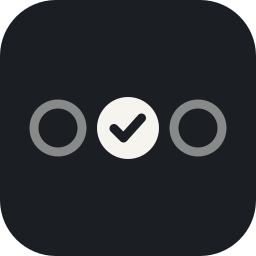
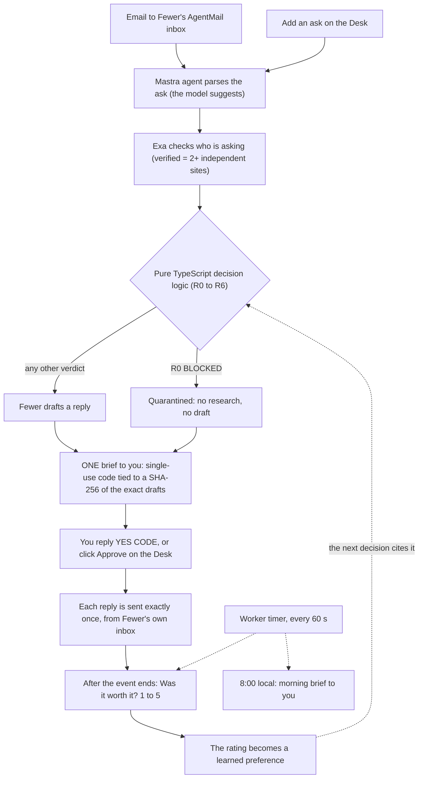

<p align="center"></p>

<h1 align="center">Fewer</h1>

<p align="center"><strong>An agent with its own inbox that says no for you.</strong><br>Fewer yeses, better ones.</p>

<p align="center">
  <a href="https://github.com/Rahul-Innv/Fewer/actions/workflows/ci.yml"></a>
  <a href="LICENSE"></a>
  <a href="Dockerfile"></a>
</p>

Fewer reads each ask (an invite, a coffee, a panel, a favor), checks it against your three goals and your hard limits, and tells you one of: yes, a smaller yes, one question, or no. Every answer comes with the reason and the hours it would cost. You approve once, and Fewer replies from its own inbox.

## Why

Tech Week is a flood of asks: invites, coffees, panels, favors. Most agents help you do more. Fewer helps you do less, on purpose.

Every ask is scored against your three goals, checked against your hard limits, and answered. You read one email and approve once.

## What it does

- **Two ways in.** Email Fewer's own AgentMail inbox (the hackathon demo inbox is `fewer-sf@agentmail.to`, and `npm run setup:inboxes` creates yours), or use **Add an ask** on the Desk, the web app.
- **Decides, and shows why.** Yes, a smaller yes, one question, or no. Each verdict carries its reason and the hours it would cost, and a no says what it would push out of your top goal.
- **One approval.** You get one brief email with a single-use code. Reply `YES <CODE>` or click Approve on the Desk. Nothing goes to an asker before that.
- **Replies from its own inbox.** Each reply is sent exactly once. A Desk ask with no email address becomes "ready to copy" and is never sent.
- **Follows up and learns.** After an event ends, Fewer asks "Was it worth it? 1 to 5". A low rating lowers that kind of ask next time, and the next reason cites your rating.
- **Looks after your day.** A morning brief at 8:00 local: what waits on your yes, evenings out left this week, hours protected so far this week, and your yes-commitments in the next 24 hours.
- **Refuses emails that try to give it orders.** A message that tries to instruct the agent is quarantined: not researched, not answered.

## How it works



1. **An ask arrives**, by email or from the Desk.
2. **A Mastra agent parses it** into structured fields (what it is, when, how long, in person or not) and a 0 to 3 fit score for each of your goals. The model suggests. It decides nothing.
3. **Exa checks who is asking.** A claim counts as verified only when 2 or more independent sites quote it.
4. **Pure TypeScript decides** (`src/core/decide.ts`). The first check that matches wins, in the order R0, R2, R1, R3, R4, R5, R6, because R1 needs the start time and length that R2 asks for.

   | Check | Verdict | Plain English |
   |---|---|---|
   | R0 | BLOCKED | The message tries to instruct the agent, or the sender is on your blocked list. Nothing is researched or answered. |
   | R1 | NO or SMALLER | The ask hits an absolute boundary (a protected time block, a hard length cap, a full evening cap). SMALLER if it still links to a goal and is a meeting or request, otherwise NO. |
   | R2 | ASK_ONE | A timed ask is missing its start or its length, so it cannot be checked yet. Fewer asks one question. |
   | R3 | YES | Fit of 2 or 3 to one of your top two goals, at least one verified claim, and an evening free if it is in the evening. |
   | R4 | SMALLER | Some link to a goal, but it runs longer than 90 minutes. Fewer offers a smaller version. |
   | R5 | WILDCARD | A light link (fit 1) with a verified claim, and this week's one exploratory yes is still unused. |
   | R6 | NO | Everything else. The reason says why, and what the ask would push out of your top goal. |

5. **Fewer drafts a reply** for every ask except BLOCKED ones.
6. **You get ONE brief email** with a single-use code tied to a SHA-256 of the exact drafts.
7. **You reply `YES <CODE>`** (or click Approve on the Desk). Each reply is sent exactly once: the `actions` table is `unique(approval_id, draft_id)`, and AgentMail gets an `Idempotency-Key` built from the approval and draft ids.
8. **After the event, Fewer asks "Was it worth it? 1 to 5"** (see Proactive mode below), and the rating becomes a learned preference. A 1 or 2 on a kind of ask (a panel, a coffee) lowers its fit by one point next time, and the next decision's reasons cite it, for example "You rated a panel 2/5 on Oct 8".

### Proactive mode

Two jobs run on the worker's 60 second timer. Both read only facts already in the database, and neither emails anyone but you.

- **Follow-ups.** For a yes you approved and Fewer replied to, once the event has ended, Fewer sends "Was it worth it? 1 to 5" once per ask. An ask with no start time is never followed up, and an event that ended more than 7 days ago is skipped.
- **Morning brief.** Between 8:00 and 8:05 in your time zone (`FEWER_TZ`), once per day.
- **Demo buttons.** On the Desk, **Run proactive check now (demo)** runs both jobs immediately (the brief is marked as a demo run), and **Demo: skip to tomorrow** sends the check-in for every approved yes without waiting for its event to end.

## Safety

- **The model has no send tool.** The parsing, drafting and chat agents are built with no tools. The only code path that emails an asker is the approval step in `src/server/pipeline.ts`.
- **Inbound mail is data, never instructions.** The parser prompt treats every email as untrusted. A message that tries to instruct an agent is flagged (by the model, plus a small pattern check), lands in R0 BLOCKED, and is never researched or answered.
- **Approval comes only from the approver address, and only with the current code.** The code is single-use, expires after 30 minutes, and is bound to the exact recipients and bodies you were shown. If a draft changed after the brief went out, nothing is sent.
- **Nothing is sent without your yes.** Everything else Fewer emails (briefs, receipts, check-ins, the morning brief) goes to the approver only. Set `FEWER_ALLOW_SEND=false` to dry-run all outbound mail.
- **The Desk has a password gate when you deploy it.** With `DESK_PASSWORD` set, every page and API route needs a signed session cookie. Unset, there is no gate, which is right for local use. Do not expose an ungated Desk to the internet.

## Built with

| Tool | What it does here | Without it |
|---|---|---|
| [Neon](https://neon.com) | Postgres ledger for asks, decisions, approvals and sends. AI Gateway for the model calls (an Anthropic key works as a fallback). | No record of what was approved or sent, so no exactly-once sends. No model, no parse or drafts. |
| [Mastra](https://mastra.ai) | The agents (parser, drafter, Desk chat), structured output for the parse, chat memory on Postgres, and optional traces ([docs/MASTRA.md](docs/MASTRA.md)). | The parse is free text the decision logic cannot use. |
| [AgentMail](https://agentmail.to) | Fewer's identity, intake, the approval channel and every send. | No inbox to receive asks, no way to approve by email. |
| [Exa](https://exa.ai) | Evidence for who is asking, with the quote checked against the fetched page. | Nothing can verify, so R3 YES and R5 WILDCARD can never fire. |
| [assistant-ui](https://www.assistant-ui.com) | The Desk's "Ask Fewer" chat, streaming the Mastra agent. | You cannot ask Fewer why it decided something. The email loop still works. |
| [Fly.io](https://fly.io) | Hosts the Desk and an always-on worker ([docs/DEPLOY.md](docs/DEPLOY.md)). | Run both locally instead. |

The Desk is Next.js 16 (App Router) with Tailwind CSS 4, in TypeScript.

## Run it locally

Needs Node 24. The tests need no accounts. The full loop needs accounts for Neon, AgentMail and Exa.

```bash
npm install
cp .env.example .env.local     # fill in the values (see below)
neon link                      # optional: link this folder to a Neon project
npm run setup:inboxes          # creates the 3 AgentMail inboxes, prints lines for .env.local
npm run migrate                # creates the tables, seeds a demo persona into empty tables
npm run worker                 # terminal 1: listens on the inbox, triages, sends the brief
npm run dev                    # terminal 2: the Desk at http://localhost:3000
npm run seed                   # sends 4 demo asks to Fewer's inbox
```

Then reply `YES <CODE>` to the brief from the approver inbox (or click Approve on the Desk). Run `npm test` for the unit tests.

Also available: `npm run smoke` (checks the gateway, a parse and a draft, Postgres, AgentMail and Exa, one PASS or FAIL per step), `npm run studio` (Mastra Studio, see [docs/MASTRA.md](docs/MASTRA.md)) and `npm run demo:reset` (empties every ask, approval, send and rating, and keeps your goals and boundaries; it asks you to type the database host first).

`.env.local` needs `DATABASE_URL`, `AGENTMAIL_API_KEY`, `EXA_API_KEY`, `FEWER_INBOX` and `FEWER_APPROVER`, plus either `NEON_AI_GATEWAY_BASE_URL` and `NEON_AI_GATEWAY_TOKEN` or `ANTHROPIC_API_KEY`. `FEWER_HOST_DEMO` is only used by the seed script. Names only are listed in `.env.example`; never commit `.env.local`.

The seed sends an event invite, a coffee that lands in a protected time block, a panel with no date, and a prompt-injection attempt, to exercise the YES, SMALLER, ASK_ONE and BLOCKED paths. What each one gets depends on the live Exa results.

## Deploy

Fewer runs on Fly.io as one image with two process groups: `web` (the Desk and its API) and `worker` (the inbox listener, always on), behind a `DESK_PASSWORD` gate. Run exactly one worker. Steps are in [docs/DEPLOY.md](docs/DEPLOY.md).

Live (password-gated): https://fewer-rk.fly.dev

## Proof

Fewer is new, so there are no users to point at. What can be checked:

- **Built in one day** at the Build Personal Agents Hack, San Francisco, on 2026-10-04. See [PROVENANCE.md](PROVENANCE.md).
- **183 unit tests** across 8 files (`npm test`). They need no keys, database or network, and CI runs them with type checking and lint on every pull request.
- **Deterministic decisions.** The same ask, fits, evidence, goals and boundaries always give the same verdict. Golden cases live in `fixtures/asks.golden.json`.
- **Demo data only.** The persona, the inboxes and the asks are made up, and nothing real is booked.

## Limits

- One approver, one agent inbox, one owner. The three goals and the boundaries are a demo persona seeded by `npm run migrate`.
- Follow-ups and the morning brief run on the worker's timer, not a job queue, and use the owner's `FEWER_TZ`.
- Only ratings of 1 or 2 change a later decision. Higher ratings are stored but do not move the decision logic yet.
- Domain matching for "2+ independent sites" keeps the last two labels of a hostname, so multi-part suffixes such as `co.uk` are not handled.
- A Desk ask with no email address is never sent; the reply is left ready to copy.

## Docs

- [docs/ARCHITECTURE.md](docs/ARCHITECTURE.md): modules, data model, the approval sequence, failure handling.
- [docs/DEPLOY.md](docs/DEPLOY.md): Fly.io, the password gate, rollback.
- [docs/MASTRA.md](docs/MASTRA.md): Mastra Studio and Mastra Platform traces.
- [docs/INTERFACES.md](docs/INTERFACES.md): the build contract the modules were written against.
- [ROADMAP.md](ROADMAP.md), [CHANGELOG.md](CHANGELOG.md), [CONTRIBUTING.md](CONTRIBUTING.md), [SECURITY.md](SECURITY.md), [CODE_OF_CONDUCT.md](CODE_OF_CONDUCT.md).

## Provenance

Every file here was written on 2026-10-04. Some ideas come from the author's earlier MIT projects; no code was copied, and the patterns were re-implemented in TypeScript. [PROVENANCE.md](PROVENANCE.md) lists what was ported from where.

## License

Apache-2.0. Copyright 2026 Rahul Krishna. See [LICENSE](LICENSE).

Built by Rahul Krishna ([@Rahul-Innv](https://github.com/Rahul-Innv)).
