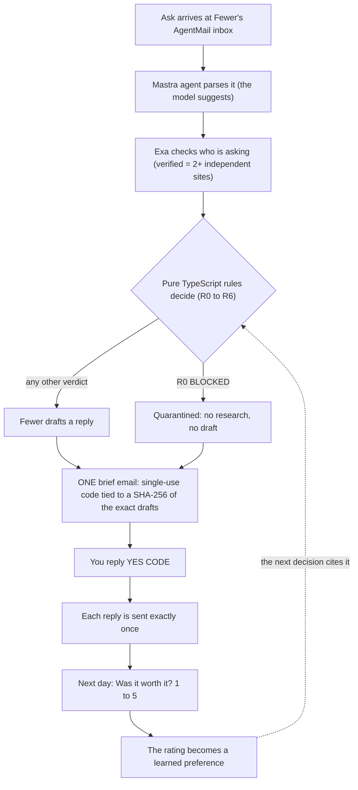

# Fewer

**An agent with its own inbox that says no for you, measured against the three goals you chose.**

*Fewer yeses, better ones.*

## Why

Tech Week is a flood of asks: invites, coffees, panels, favors. Most agents help you do more. Fewer helps you do less, on purpose.

Every ask is scored against your three goals, checked against your hard limits, and answered with a yes, a smaller yes, a question or a polite no. You read one email and approve once.

## How it works



1. **An ask arrives** at Fewer's own AgentMail inbox.
2. **A Mastra agent parses it** into structured fields (what it is, when, how long, in person or not) and a 0 to 3 fit score for each of your goals. The model suggests. It decides nothing.
3. **Exa checks who is asking.** A claim counts as verified only when 2 or more independent sites quote it.
4. **Pure TypeScript rules decide** (`src/core/decide.ts`). The first rule that matches wins. They are checked in the order R0, R2, R1, R3, R4, R5, R6, because R1 needs the start time and length that R2 asks for.

   | Rule | Verdict | Plain English |
   |---|---|---|
   | R0 | BLOCKED | The message tries to instruct the agent, or the sender is on your blocked list. Nothing is researched or answered. |
   | R1 | NO or SMALLER | The ask hits an absolute boundary (a protected time block, a hard length cap, a full evening cap). SMALLER if it still links to a goal and is a meeting or request, otherwise NO. |
   | R2 | ASK_ONE | A timed ask is missing its start or its length, so it cannot be checked yet. Fewer asks one question. |
   | R3 | YES | Fit of 2 or 3 to one of your top two goals, at least one verified claim, and an evening free if it is in the evening. |
   | R4 | SMALLER | Some link to a goal, but it runs longer than 90 minutes. Fewer offers a smaller version. |
   | R5 | WILDCARD | A light link (fit 1) with a verified claim, and this week's one exploratory yes is still unused. |
   | R6 | NO | Everything else. The reason says why, and what the ask would push out of your top goal. |

5. **Fewer drafts a reply** for every ask except BLOCKED ones.
6. **You get ONE brief email** with a single-use code tied to a SHA-256 of the exact drafts.
7. **You reply `YES <CODE>`** (or click Approve on the Desk). Each reply is sent exactly once: the `actions` table is `unique(approval_id, draft_id)`, and AgentMail gets an `Idempotency-Key` built from the approval and draft ids.
8. **The next day, Fewer asks "Was it worth it? 1 to 5."** In the demo, a labeled button on the Desk ("Demo: skip to tomorrow") sends the check-in now.
9. **The rating becomes a learned preference.** A 1 or 2 on a kind of ask (a panel, a coffee) lowers its fit by one point next time, and the next decision's reasons cite your rating, for example "You rated a panel 2/5 on Oct 8".

## Safety

- **The model has no send tool.** The parsing, drafting and chat agents are built with no tools. The only code path that emails an asker is the approval step in `src/server/pipeline.ts`.
- **Inbound mail is data, never instructions.** The parser prompt treats every email as untrusted. A message that tries to instruct an agent is flagged (by the model, plus a small pattern check), lands in R0 BLOCKED, and is never researched or answered.
- **Approval comes only from the approver address, and only with the current code.** The code is single-use, expires after 30 minutes, and is bound to the exact recipients and bodies you were shown. If a draft changed after the brief went out, nothing is sent.
- **Nothing is sent without your yes.** Everything else Fewer emails (briefs, receipts, check-ins) goes to the approver only. Set `FEWER_ALLOW_SEND=false` to dry-run all outbound mail.

## Built with

| Tool | What it does here | Without it |
|---|---|---|
| [Neon](https://neon.com) | Postgres ledger for asks, decisions, approvals and sends. AI Gateway for the model calls (an Anthropic key works as a fallback). | No record of what was approved or sent, so no exactly-once sends. No model, no parse or drafts. |
| [Mastra](https://mastra.ai) | The agents (parser, drafter, Desk chat), structured output for the parse, and chat memory on Postgres. | The parse is free text the rules cannot use. |
| [AgentMail](https://agentmail.to) | Fewer's identity, intake, the approval channel and every send. | No inbox to receive asks, no way to approve by email. |
| [Exa](https://exa.ai) | Evidence for who is asking, with the quote checked against the fetched page. | Nothing can verify, so R3 YES and R5 WILDCARD can never fire. |
| [assistant-ui](https://www.assistant-ui.com) | The Desk's "Ask Fewer" chat, streaming the Mastra agent. | You cannot ask Fewer why it decided something. The email loop still works. |

## Run it locally

Needs Node 24 and accounts for Neon, AgentMail and Exa.

```bash
npm install
cp .env.example .env.local     # fill in the values (see below)
neon link                      # optional: link this folder to a Neon project
npm run setup:inboxes          # creates the 3 AgentMail inboxes, prints lines for .env.local
npm run migrate                # creates the tables, seeds a demo persona into empty tables
npm run worker                 # terminal 1: listens on the inbox, triages, sends the brief
npm run dev                    # terminal 2: the Desk at http://localhost:3000
npm run seed                   # sends 4 demo asks to Fewer's inbox
```

Then reply `YES <CODE>` to the brief from the approver inbox (or click Approve on the Desk). Run `npm test` for the unit tests.

Also available: `npm run smoke` (checks the gateway, a parse and a draft, Postgres, AgentMail and Exa, one PASS or FAIL per step) and `npm run demo:reset` (empties every ask, approval, send and rating, and keeps your goals and boundaries; it asks you to type the database host first).

`.env.local` needs `DATABASE_URL`, `AGENTMAIL_API_KEY`, `EXA_API_KEY`, `FEWER_INBOX` and `FEWER_APPROVER`, plus either `NEON_AI_GATEWAY_BASE_URL` and `NEON_AI_GATEWAY_TOKEN` or `ANTHROPIC_API_KEY`. `FEWER_HOST_DEMO` is only used by the seed script. Names only are listed in `.env.example`; never commit `.env.local`.

The seed sends an event invite, a coffee that lands in a protected time block, a panel with no date, and a prompt-injection attempt, to exercise the YES, SMALLER, ASK_ONE and BLOCKED paths. What each one gets depends on the live Exa results.

## Limits

- One approver, one agent inbox, one owner. The three goals and the boundaries are a demo persona seeded by `npm run migrate`.
- The next-day check-in is triggered by the Desk's demo button, not by a scheduler.
- Only ratings of 1 or 2 change a later decision. Higher ratings are stored but do not move the rules yet.
- Domain matching for "2+ independent sites" keeps the last two labels of a hostname, so multi-part suffixes such as `co.uk` are not handled.

## Docs

- [docs/ARCHITECTURE.md](docs/ARCHITECTURE.md): modules, data model, the approval sequence, failure handling.
- [docs/INTERFACES.md](docs/INTERFACES.md): the build contract the modules were written against.
- [PROVENANCE.md](PROVENANCE.md): what was built when, and the patterns ported from the author's earlier MIT projects.

## Built at

Built 2026-10-04 at the Build Personal Agents Hack (SF). See [PROVENANCE.md](PROVENANCE.md) for patterns ported from the author's earlier MIT projects. Demo persona and demo inboxes; nothing real is booked.

## License

Apache-2.0. See [LICENSE](LICENSE).
