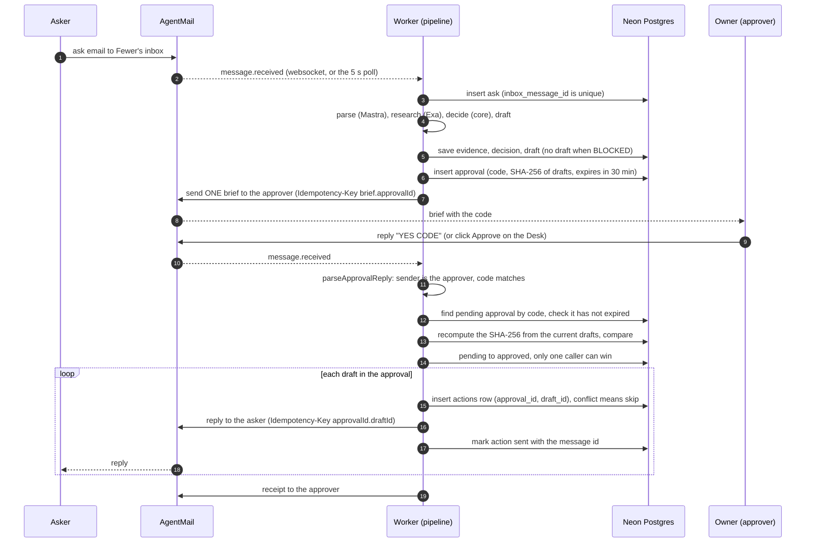

# Architecture

Fewer is a small pipeline around one idea: the model suggests, the decision logic decides, and a human approves.

- The **model** (Mastra agents) turns an email into structured facts and writes draft replies. It has no tools and no way to send.
- The **decision logic** (`src/core`) is pure TypeScript. Given the same ask, fits, evidence, goals and boundaries, it returns the same verdict.
- The **approval step** is the only place an asker gets email, and it needs the owner's `YES <CODE>` first.

The interface contract the modules were written against is in [INTERFACES.md](INTERFACES.md). This page describes what the code does.

## Modules

| Path | Role | Notes |
|---|---|---|
| `src/core/` | Pure decision logic. No network, no database, no clock reads. | Depends only on `zod` and `node:crypto`. |
| `src/core/contracts.ts` | zod schemas and types: `Journey`, `Boundary`, `ParsedAsk`, `Fit`, `EvidenceClaim`, `DecisionContext`, `Decision`. | Also `normalizeEmail`. |
| `src/core/decide.ts` | `decide()`: checks R0 to R6, plus local-time and time-block overlap helpers. | See the decision table in the [README](../README.md). |
| `src/core/corroborate.ts` | `corroborate()`: a claim is verified when its quote-found sources span 2 or more registrable domains. | |
| `src/core/approval.ts` | `canonicalJson`, `sha256Hex`, `makeApprovalCode` (4 characters, no 0/O/1/I/L), `parseApprovalReply`. | |
| `src/server/` | Integrations and the pipeline. Server only. | |
| `src/server/env.ts` | zod-validated environment, model names (`neon/claude-haiku-4-5` for parsing, `neon/claude-sonnet-4-6` for drafting and chat, `anthropic/...` if only an Anthropic key is set), dry-run switch. | |
| `src/server/mail.ts` | AgentMail client: `sendMail`, `replyTo` (both take an idempotency key), `getMessage`, `listenInbox`. | `listenInbox` runs a websocket and a 5 s poll together. |
| `src/server/research.ts` | Exa search and `getContents`. Sets `quoteFound` by checking the quote appears in the fetched page text. | Never throws, 25 s overall budget. |
| `src/server/llm.ts` | Mastra agents: parser, drafter and the Desk chat agent (`fewerAgent`, with Postgres memory). `parseAsk`, `draftReply`. | No agent has tools. |
| `src/server/db.ts` | Lazy `postgres` client for Neon and every query the pipeline and Desk use. | |
| `src/server/pipeline.ts` | Email intake and triage: `handleInbound`, `triage`. Briefs and approval: `sendBrief`, `approveByCode`, `declineApproval`. Desk intake: `submitWebAsk`, `runWebAsk`. Proactive mode: `runDueCheckins`, `runMorningBrief`, `runMorningBriefIfDue`, `buildMorningBrief`. Demo time skip: `timeSkipCheckins`. | Loads `llm` and `research` lazily so Desk API routes do not bundle Mastra and Exa. |
| `src/mastra/` | `factory.ts` builds the one Mastra instance (the three agents, Postgres storage, tracing). `index.ts` is the Mastra Studio entry. | See [MASTRA.md](MASTRA.md). App code reaches the instance through `factory.ts`. |
| `scripts/worker.ts` | The long-running process: listens on the inbox, drives the pipeline, runs the timers. | See "Processes". |
| `scripts/` (others) | `migrate.ts`, `setup-inboxes.ts`, `seed.ts`, `smoke.ts`, `demo-reset.ts`. | Run through `npm run ...`. |
| `src/app/` | The Desk (Next.js App Router) and its API routes: `/api/desk`, `/api/approve`, `/api/decline`, `/api/timeskip`, `/api/chat`, `/api/asks`, `/api/proactive`, `/api/login`. | |
| `src/proxy.ts` | The Desk password gate (the Next.js 16 `proxy`, formerly middleware). | A no-op in development unless `DESK_PASSWORD` is set; fails closed in production without it, unless `DESK_GATE=off` is set explicitly. See "Deployment". |
| `src/components/` | Desk UI (`desk/`, including `AskComposer` and `ProactivePanel`) and the assistant-ui chat drawer (`chat/`). | |
| `sql/001_init.sql` | The schema. Every statement is `create ... if not exists`. | |
| `fixtures/asks.golden.json` | Golden cases for `decide()`. | Read by `src/core/__tests__/decide.test.ts`. |

Dependencies point one way: `src/core` knows nothing about `src/server`, and the pipeline calls into core, never the reverse.

## Processes

Two processes share one Neon database.

- **Worker** (`npm run worker`). Runs migrations, listens on the Fewer inbox, and calls `handleInbound` for each message without blocking the listener, so a burst of asks is triaged in parallel. After the last triage finishes it waits 8 s and sends **one** brief for everything waiting. On start it resumes asks stuck in `received`. Three timers run every 60 s: one marks expired approvals, one sends due follow-ups (`runDueCheckins`), and one checks whether it is time for the morning brief (`runMorningBriefIfDue`). See "Proactive mode".
- **Desk** (`npm run dev`, or `npm run start` once built). The Next.js app. It reads the tables directly through `/api/desk` (polled every 2.5 s by the page) and calls `approveByCode`, `declineApproval` and `timeSkipCheckins` from its API routes. `/api/asks` records a pasted ask and `/api/proactive` runs the demo check. `/api/chat` streams the Mastra chat agent to assistant-ui. The route receives the chat thread plus a read-only snapshot of the Desk (goals, boundaries, ask titles, verdicts and reasons), and the chat agent has no tools.

## Deployment

On Fly.io the same image runs as two process groups from `fly.toml`: `web` (the Desk and `/api/*`, public) and `worker` (`scripts/worker.ts`, no public service). Run exactly one worker: the listener dedupes by message id in memory, so two of them would both handle every email. Schema migrations run inside the worker on boot. [DEPLOY.md](DEPLOY.md) has the steps, the rollback commands and the tradeoffs.

The Desk is protected by `src/proxy.ts` when `DESK_PASSWORD` is set. Every page and API route then needs the signed `fewer_desk` cookie (HMAC-SHA256 over an expiry, HttpOnly, 12 hours), except `/login` and `/api/login`. Pages redirect to `/login` and `/api/*` answers `401`. With the variable unset, the gate does nothing in development and locks every route with `503` in production, unless `DESK_GATE=off` is set on purpose.

## Intake channels

An ask enters in one of two ways, and both end in the same `triage`.

- **Email.** `listenInbox` hands each new message to `handleInbound`. Mail from the approver address is checked first: a reply on a brief's thread is an approval, a reply on a check-in's thread is a rating, and anything else on a thread Fewer started is a note, not an ask. Everything else is a new ask, deduplicated by `inbox_message_id`.
- **The Desk.** `POST /api/asks` (`submitWebAsk`) stores the pasted text with an `inbox_message_id` of `web-<uuid>`, answers `202` at once, and runs `runWebAsk` after the response (Next's `after`): triage, then one brief for that ask. The page polls `/api/desk`, so the card moves from "Reading..." to a verdict. The text is capped at 5,000 characters and the asker's email is optional.

A Desk ask with no usable email address can be approved like any other, but nothing is sent. Its action row is marked `ready`, the ask status becomes `ready`, and the receipt to the approver says "1 reply ready to copy on the Desk (nothing sent)".

## Proactive mode

Two jobs run from the worker's timer, and the Desk's labeled demo button runs both on demand. Both read only facts already in the database. Neither looks for new events, creates asks, or emails anyone but the approver. Each job has its own queue, so a timer tick and a button click cannot overlap.

- **Follow-ups** (`runDueCheckins`). Takes the asks with status `sent` whose latest decision is YES or WILDCARD and that have no check-in row, and keeps those whose event has ended: start time plus duration (60 minutes if none was stated). An ask with no start time is never due, and one that ended more than 7 days ago is skipped, so a long outage cannot flood the owner. The email is "Was it worth it? Reply 1 to 5", sent with `Idempotency-Key: checkin.<askId>`, and the check-in row is inserted only if none exists, so the worker and the Desk's "Demo: skip to tomorrow" button cannot double-send. The reply is matched back by `thread_id` and stored as an `outcomes` row.
- **Morning brief** (`runMorningBriefIfDue`). Runs only between 08:00 and 08:05 in `FEWER_TZ`, and only if no `morning_brief` event is logged for that local date. `buildMorningBrief` is pure: it takes asks waiting on approval, the boundaries, live yes-commitments and this week's decisions, and returns the email and a one-line summary for the Desk. It reports what waits on the owner's yes, evenings out left this week (the absolute weekly cap minus committed in-person evening asks), hours protected so far this week, and yes-commitments starting in the next 24 hours. Anything it could not read is shown as "unknown", never guessed, and ask titles are cleaned to one line because they are untrusted text. The send uses `Idempotency-Key: morning.<date>`.
- **Demo.** `POST /api/proactive` runs `runDueCheckins`, then `runMorningBrief` with `demo: true`. A demo brief has its own idempotency key, a "(demo run)" subject and a `demo` flag in its event, so a rehearsal can neither use up nor suppress the real 8:00 brief. `GET /api/proactive` returns the latest brief for the Desk panel.

## Data model

Eleven tables hold the ledger. Mastra creates its own memory tables on the same `DATABASE_URL` through `PostgresStore`.

| Table | Holds | Key points |
|---|---|---|
| `journeys` | The owner's three goals (`rank`, `title`, `keywords`). | |
| `boundaries` | Limits with a `strength` (`absolute`, `ask_first`, `preference`) and a typed `rule` (time block, evenings per week, blocked sender, max minutes). | Only `absolute` conflicts trigger R1. Others become "heads up" notes. |
| `asks` | Each inbound message and its parsed form. | `inbox_message_id` is unique, so redelivery is skipped. `status`: `received`, `triaged`, `awaiting_approval`, `sent`, `ready`, `declined`, `blocked`, `error`. |
| `evidence` | Exa claims per ask, with sources, quotes and `quoteFound`. | |
| `decisions` | Verdict, check id, reasons and the fits, as stored by `decide()`. | The latest row per ask is the live one. |
| `drafts` | The reply to send for an ask. | `saveDraft` replaces a draft only if it is not in an approved approval and has no action row. |
| `approvals` | One per brief: `code`, `payload_sha256`, `draft_ids`, `status`, `expires_at`, `used_at`. | `status`: `pending`, `approved`, `declined`, `expired`. 30 minute TTL. |
| `actions` | The send ledger, one row per draft handled under an approval. | `unique (approval_id, draft_id)`. Status `sending`, `sent`, `failed` or `ready` (a Desk ask with no address: approved, not sent). |
| `checkins` | The "Was it worth it?" email sent for an ask. | Matched back by `thread_id`. One per ask. |
| `outcomes` | The rating (1 to 5), the ask's `tag`, an optional note. | `decide()` reads these as `ratings`. |
| `events_log` | Append-only audit trail (`received`, `triaged`, `brief`, `approved`, `approval_refused`, `checkin_sent`, `morning_brief`, `error`, ...). | The `brief` row maps the brief's thread id to its approval id. |

## Approval and exactly-once sends

Where each guarantee lives:

1. **Only the approver.** `parseApprovalReply` compares the normalized sender to `FEWER_APPROVER`. Mail from anyone else is handled as an ordinary ask, never as an approval.
2. **Only the current code.** The code is 4 characters from a 31-symbol alphabet, chosen from `randomBytes`. It matches only a `pending`, unexpired approval, and a mismatch is ignored with a nudge.
3. **Exactly what you saw.** `payload_sha256` is the SHA-256 of the canonical JSON of every draft's id, recipient and body, sorted by id. Approval recomputes it from the drafts as they are now.
4. **Single use.** `claimApproval` is one `update ... where status = 'pending' and expires_at > now()`. Two simultaneous approvals (email and Desk) cannot both win.
5. **No duplicate sends.** The `actions` row is inserted before the send, with `unique (approval_id, draft_id)`. The AgentMail request carries `Idempotency-Key: <approvalId>.<draftId>`, so a retried HTTP call is also collapsed.

Declining (`NO` by email or the Desk) goes through the same single-use claim, marks the asks `declined` and sends nothing to askers.

A send that fails is recorded as `failed` with its error and shown on the Desk. It is not retried automatically, which keeps the guarantee at "never twice".

## Failure handling

| What goes wrong | What Fewer does |
|---|---|
| **Exa errors or takes longer than 25 s** | `researchAsk` returns no claims and logs a warning. With zero verified claims, R3 YES and R5 WILDCARD cannot fire, so the ask resolves through the other checks (typically R6 NO). The Desk shows "No outside sources found for this ask" when nothing came back, and "unverified, couldn't check" on any source that was not corroborated by a second domain. |
| **AgentMail websocket drops** | `listenInbox` reconnects with backoff from 1 s up to 30 s. The 5 s `messages.list` poll runs the whole time, so new mail is picked up either way. Duplicates are dropped by message id in memory and by `asks.inbox_message_id` in the database. A handler that throws is retried up to 3 times. On start, inbound mail from the last 30 minutes without the `fewer-processed` label is replayed (it arrived while the worker was down); older or already-processed mail is skipped. Replay is safe: asks dedupe on `inbox_message_id`, approval codes are single-use, and check-in replies are gated. |
| **Approval code expired** | After 30 minutes the code no longer matches. The approver gets a "Not sent" reply: "code expired" if `approveByCode` sees it first, or "no pending approval with that code" if the worker's 60 s sweep already marked it `expired`. The drafts are no longer attached to a live approval, so the next brief includes them again. |
| **Drafts changed since the brief** | The hash recomputed at approval time differs (or a draft is missing). The approval is marked `expired`, an `approval_refused` event is logged, and the approver gets "Not sent: drafts changed since approval." Nothing is sent. |
| **Wrong code, or a reply from someone else** | A wrong code from the approver is ignored with a hint to use the code shown in the brief. A reply from anyone else is never treated as an approval. |
| **Approve clicked twice, or email and Desk together** | One caller wins `claimApproval`. The other is refused and sends nothing. |
| **Brief fails to send** | The approval is marked `expired` so its drafts can go into the next attempt, and the error is logged. |
| **Triage throws** (model, parse, database) | The ask is set to `error` and an `error` event is logged. The worker keeps running. |
| **Prompt injection in an email** | The ask is decided R0 BLOCKED. It is not researched, gets no draft, and appears in the next brief as "no action taken". |
| **Worker restarts mid-triage** | On start it re-triages any ask still in `received`. |
| **Worker is down when an event ends** | The follow-up goes out on the first timer tick after it is back, as long as the event ended less than 7 days ago. Older events are skipped. |
| **Morning brief cannot be sent** | The error is logged and the job never throws. No `morning_brief` event is recorded, so a tick inside the 08:00 to 08:05 window tries again. |
| **A Desk ask has no email address** | It can be approved, but nothing is sent. It is marked `ready` and the receipt says the reply is ready to copy. |
| **Missing credentials** | `assertModelCredentials` and `requireEnv` fail fast with the names of the missing variables. |
