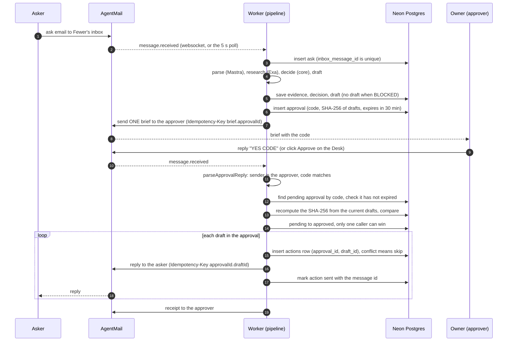

# Architecture

Fewer is a small pipeline around one idea: the model suggests, the rules decide, and a human approves.

- The **model** (Mastra agents) turns an email into structured facts and writes draft replies. It has no tools and no way to send.
- The **rules** (`src/core`) are pure TypeScript. Given the same ask, fits, evidence, goals and boundaries, they return the same verdict.
- The **approval step** is the only place an asker gets email, and it needs the owner's `YES <CODE>` first.

The interface contract the modules were written against is in [INTERFACES.md](INTERFACES.md). This page describes what the code does.

## Modules

| Path | Role | Notes |
|---|---|---|
| `src/core/` | Pure rules. No network, no database, no clock reads. | Depends only on `zod` and `node:crypto`. |
| `src/core/contracts.ts` | zod schemas and types: `Journey`, `Boundary`, `ParsedAsk`, `Fit`, `EvidenceClaim`, `DecisionContext`, `Decision`. | Also `normalizeEmail`. |
| `src/core/decide.ts` | `decide()`: rules R0 to R6, plus local-time and time-block overlap helpers. | See the rule table in the [README](../README.md). |
| `src/core/corroborate.ts` | `corroborate()`: a claim is verified when its quote-found sources span 2 or more registrable domains. | |
| `src/core/approval.ts` | `canonicalJson`, `sha256Hex`, `makeApprovalCode` (4 characters, no 0/O/1/I/L), `parseApprovalReply`. | |
| `src/server/` | Integrations and the pipeline. Server only. | |
| `src/server/env.ts` | zod-validated environment, model names (`neon/claude-haiku-4-5` for parsing, `neon/claude-sonnet-4-6` for drafting and chat, `anthropic/...` if only an Anthropic key is set), dry-run switch. | |
| `src/server/mail.ts` | AgentMail client: `sendMail`, `replyTo` (both take an idempotency key), `getMessage`, `listenInbox`. | `listenInbox` runs a websocket and a 5 s poll together. |
| `src/server/research.ts` | Exa search and `getContents`. Sets `quoteFound` by checking the quote appears in the fetched page text. | Never throws, 25 s overall budget. |
| `src/server/llm.ts` | Mastra agents: parser, drafter and the Desk chat agent (`fewerAgent`, with Postgres memory). `parseAsk`, `draftReply`. | No agent has tools. |
| `src/server/db.ts` | Lazy `postgres` client for Neon and every query the pipeline and Desk use. | |
| `src/server/pipeline.ts` | `handleInbound`, `triage`, `sendBrief`, `approveByCode`, `declineApproval`, `timeSkipCheckins`. | Loads `llm` and `research` lazily so Desk API routes do not bundle Mastra and Exa. |
| `scripts/worker.ts` | The long-running process: listens on the inbox and drives the pipeline. | See "Processes". |
| `scripts/` (others) | `migrate.ts`, `setup-inboxes.ts`, `seed.ts`, `smoke.ts`, `demo-reset.ts`. | Run through `npm run ...`. |
| `src/app/` | The Desk (Next.js App Router) and its API routes: `/api/desk`, `/api/approve`, `/api/decline`, `/api/timeskip`, `/api/chat`. | |
| `src/components/` | Desk UI (`desk/`) and the assistant-ui chat drawer (`chat/`). | |
| `sql/001_init.sql` | The schema. Every statement is `create ... if not exists`. | |
| `fixtures/asks.golden.json` | Golden cases for `decide()`. | Read by `src/core/__tests__/decide.test.ts`. |

Dependencies point one way: `src/core` knows nothing about `src/server`, and the pipeline calls into core, never the reverse.

## Processes

Two processes share one Neon database.

- **Worker** (`npm run worker`). Runs migrations, listens on the Fewer inbox, and calls `handleInbound` for each message without blocking the listener, so a burst of asks is triaged in parallel. After the last triage finishes it waits 8 s and sends **one** brief for everything waiting. On start it resumes asks stuck in `received`, and every 60 s it marks expired approvals.
- **Desk** (`npm run dev`). The Next.js app. It reads the tables directly through `/api/desk` (polled every 2.5 s by the page) and calls `approveByCode`, `declineApproval` and `timeSkipCheckins` from its API routes. `/api/chat` streams the Mastra chat agent to assistant-ui. The route receives the chat thread plus a read-only snapshot of the Desk (goals, boundaries, ask titles, verdicts and reasons), and the chat agent has no tools.

## Data model

Eleven tables hold the ledger. Mastra creates its own memory tables on the same `DATABASE_URL` through `PostgresStore`.

| Table | Holds | Key points |
|---|---|---|
| `journeys` | The owner's three goals (`rank`, `title`, `keywords`). | |
| `boundaries` | Limits with a `strength` (`absolute`, `ask_first`, `preference`) and a typed `rule` (time block, evenings per week, blocked sender, max minutes). | Only `absolute` conflicts trigger R1. Others become "heads up" notes. |
| `asks` | Each inbound message and its parsed form. | `inbox_message_id` is unique, so redelivery is skipped. `status`: `received`, `triaged`, `awaiting_approval`, `sent`, `declined`, `blocked`, `error`. |
| `evidence` | Exa claims per ask, with sources, quotes and `quoteFound`. | |
| `decisions` | Verdict, rule id, reasons and the fits, as stored by `decide()`. | The latest row per ask is the live one. |
| `drafts` | The reply to send for an ask. | `saveDraft` replaces a draft only if it is not in an approved approval and has no action row. |
| `approvals` | One per brief: `code`, `payload_sha256`, `draft_ids`, `status`, `expires_at`, `used_at`. | `status`: `pending`, `approved`, `declined`, `expired`. 30 minute TTL. |
| `actions` | The send ledger, one row per draft sent under an approval. | `unique (approval_id, draft_id)`. Status `sending`, `sent` or `failed`. |
| `checkins` | The "Was it worth it?" email sent for an ask. | Matched back by `thread_id`. |
| `outcomes` | The rating (1 to 5), the ask's `tag`, an optional note. | `decide()` reads these as `ratings`. |
| `events_log` | Append-only audit trail (`received`, `triaged`, `brief`, `approved`, `approval_refused`, `error`, ...). | The `brief` row maps the brief's thread id to its approval id. |

## Approval and exactly-once sends

Where each guarantee lives:

1. **Only the approver.** `parseApprovalReply` compares the normalized sender to `FEWER_APPROVER`. Mail from anyone else is handled as an ordinary ask, never as an approval.
2. **Only the current code.** The code is 4 characters from a 31-symbol alphabet, chosen from `randomBytes`. It matches only a `pending`, unexpired approval, and a mismatch is ignored with a nudge.
3. **Exactly what you saw.** `payload_sha256` is the SHA-256 of the canonical JSON of every draft's id, recipient and body, sorted by id. Approval recomputes it from the drafts as they are now.
4. **Single use.** `claimApproval` is one `update ... where status = 'pending' and expires_at > now()`. Two simultaneous approvals (email and Desk) cannot both win.
5. **No duplicate sends.** The `actions` row is inserted before the send, with `unique (approval_id, draft_id)`. The AgentMail request carries `Idempotency-Key: <approvalId>.<draftId>`, so a retried HTTP call is also collapsed.

Declining (`NO` by email or the Desk) goes through the same single-use claim, marks the asks `declined` and sends nothing to askers.

A send that fails is recorded as `failed` with its error and shown on the Desk. It is not retried automatically, which keeps the guarantee at "never twice".

## Failure handling

| What goes wrong | What Fewer does |
|---|---|
| **Exa errors or takes longer than 25 s** | `researchAsk` returns no claims and logs a warning. With zero verified claims, R3 YES and R5 WILDCARD cannot fire, so the ask resolves through the other rules (typically R6 NO). The Desk shows "No outside sources found for this ask" when nothing came back, and "unverified, couldn't check" on any source that was not corroborated by a second domain. |
| **AgentMail websocket drops** | `listenInbox` reconnects with backoff from 1 s up to 30 s. The 5 s `messages.list` poll runs the whole time, so new mail is picked up either way. Duplicates are dropped by message id in memory and by `asks.inbox_message_id` in the database. A handler that throws is retried up to 3 times. Mail that was already in the inbox when the worker started is not replayed. |
| **Approval code expired** | After 30 minutes the code no longer matches. The approver gets a "Not sent" reply: "code expired" if `approveByCode` sees it first, or "no pending approval with that code" if the worker's 60 s sweep already marked it `expired`. The drafts are no longer attached to a live approval, so the next brief includes them again. |
| **Drafts changed since the brief** | The hash recomputed at approval time differs (or a draft is missing). The approval is marked `expired`, an `approval_refused` event is logged, and the approver gets "Not sent: drafts changed since approval." Nothing is sent. |
| **Wrong code, or a reply from someone else** | A wrong code from the approver is ignored with a hint to use the code shown in the brief. A reply from anyone else is never treated as an approval. |
| **Approve clicked twice, or email and Desk together** | One caller wins `claimApproval`. The other is refused and sends nothing. |
| **Brief fails to send** | The approval is marked `expired` so its drafts can go into the next attempt, and the error is logged. |
| **Triage throws** (model, parse, database) | The ask is set to `error` and an `error` event is logged. The worker keeps running. |
| **Prompt injection in an email** | The ask is decided R0 BLOCKED. It is not researched, gets no draft, and appears in the next brief as "no action taken". |
| **Worker restarts mid-triage** | On start it re-triages any ask still in `received`. |
| **Missing credentials** | `assertModelCredentials` and `requireEnv` fail fast with the names of the missing variables. |
